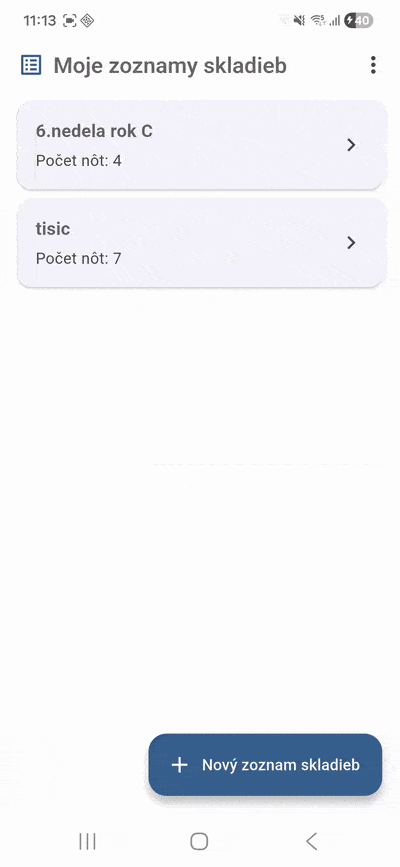
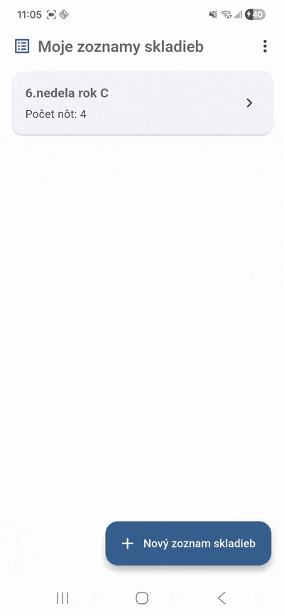
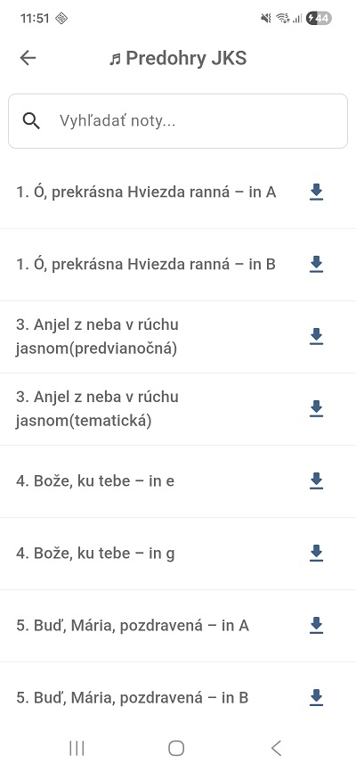
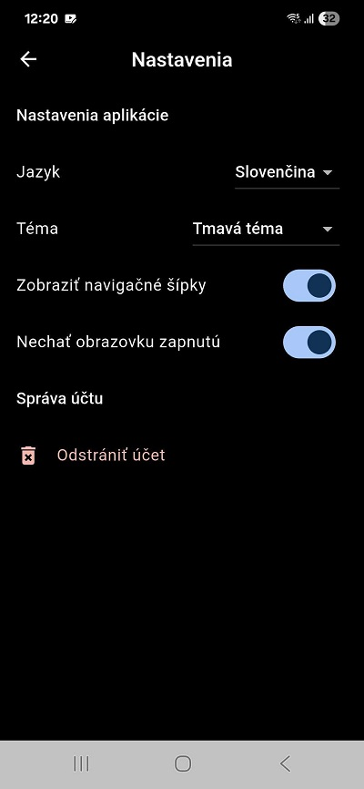
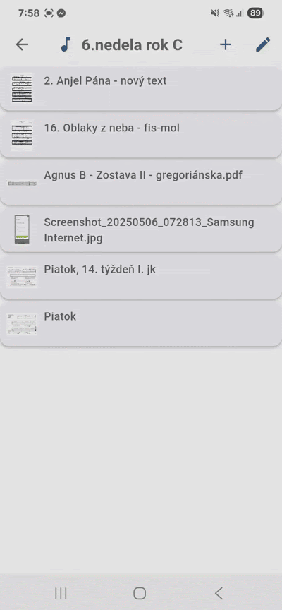
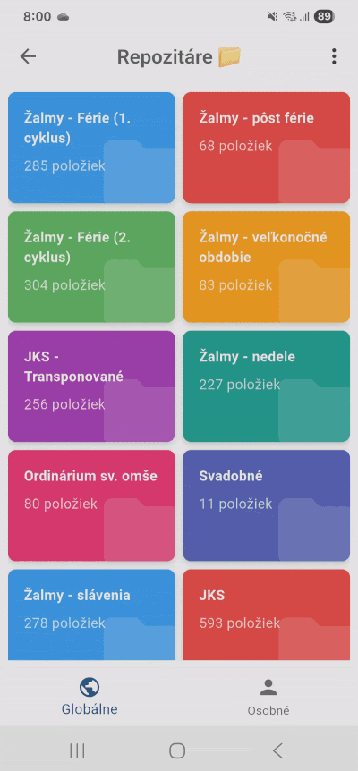
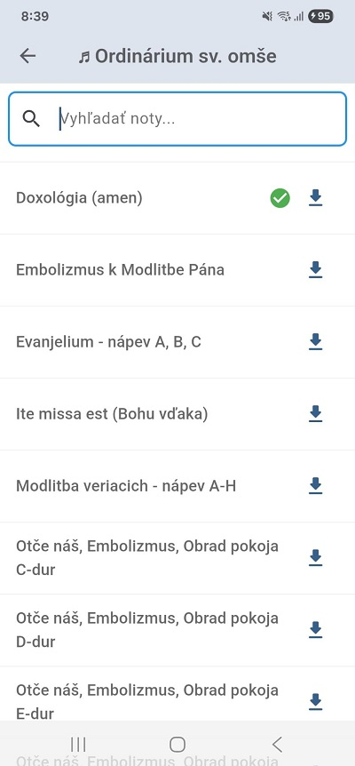

# Organista

Info about project for organists: https://sites.google.com/view/organista-app/domov 

## Changelog
### Version 1.0.6 - 4.10.2025
<table>
<tr>
<th width="33.33%">Vlastné repozitáre</th>
<th width="33.33%">Viaceré skladby do playlistu</th>
<th width="33.33%">Predohry JKS - advent</th>
</tr>
<tr>
<td width="33.33%"></td>
<td width="33.33%"></td>
<td width="33.33%"></td>
</tr>
<tr>
<td width="33.33%">Možnosť pridať vlastných repozitárov ako zložiek.</td>
<td width="33.33%">Pridávanie viacerých skladieb z repozitára naraz do playlistu.</td>
<td width="33.33%">Pridaný repozitár s predohrami JKS - advent</td>
</tr>
</table>

#### Ďalšie zmeny
- Zlepšenie chybových hlášok
- Opravená JKS 372 -> 371 
- Opravené náhľady piesní pri pridávaní nových
- Aktualizované knižnice na Firebase Functions

## Version 1.0.5 - 29.7.2025
### Pridané
- Pridané noty s Mariánskou kyticou a ďalšie svadobné
- Automatizácia procesu vydávania aplikácie
### Opravené
- Oprava chyby - po odstránení konta sa prejde na prihlasovaciu stránku
- Pri viacerých skladbách sa nedala otvoriť posledná položka v zozname kvôli blokujúcemu elementu
- Systémový panel vo farbe témy a nie stále biely
### Bezpečnosť
- Aktualizované knižnice
- Aktualizácia Flutteru na novšiu verziu
  
### Version 1.0.4 - 28.6.2025
<table>
<tr>
<th width="33.33%">Zrýchlené posúvanie strán</th>
<th width="33.33%">Prihlásenie cez Google</th>
<th width="33.33%">Ponechať obrazovku zapnutú</th>
</tr>
<tr>
<td width="33.33%"></td>
<td width="33.33%"></td>
<td width="33.33%"></td>
</tr>
<tr>
<td width="33.33%">Rýchle a spoľahlivé pretáčanie strán je pre hudobníka nevyhnutné. Nová aktualizácia zrýchlila prepínanie z takmer jednej sekundy na pár milisekúnd.</td>
<td width="33.33%">Zabudnite na zložité heslá. Prihláste sa rýchlo, bezpečne a pohodlne – stačí jeden klik.</td>
<td width="33.33%">S novým nastavením sa nemusíte obávať, že počas hrania náhle zhasne displej.</td>
</tr>
</table>

### Version 1.0.3 - 11.5.2025
<table>
<tr>
<th width="33.33%">Posúvanie strán dotykom</th>
<th width="33.33%">Indikátor pre uložené noty</th>
<th width="33.33%">Nové noty v repozitáry</th>
</tr>
<tr>
<td width="33.33%"></td>
<td width="33.33%"></td>
<td width="33.33%"></td>
</tr>
<tr>
<td width="33.33%">Pre zobrazenie ďalšej strany treba kliknúť od šípky nižšie, resp. vyššie. Táto plocha je farebne mierne do zelena odlíšená od ostatnej časti. Prepínanie dotykom sa dá vypnúť / zapnúť v nastaveniach. Zachovaná možnosť potiahnutia.</td>
<td width="33.33%">Keď otvoríte náhľad nejakej noty, uloží sa vám do zariadenia a je k dispozícii pre offline použitie. Takto označené noty viete pridať do playlistu aj bez internetu.</td>
<td width="33.33%">Odpovede v rôznych tóninách, ďalších 60 transponovaných JKS, výber svadobných...</td>
</tr>
</table>


## Releasing a new version
1. **write changelog**
2. **increase app version** + bundle
   Next steps can be omitted if release process in workflow works. 
   TODO: remove after testing
3. **compile** - `flutter clean; flutter pub get; flutter build appbundle`
4. **import debug symbols** - `/build/app/intermediates/merged_native_libs/release/mergeReleaseNativeLibs/out/lib`
5. **create a release branch**

https://stackoverflow.com/questions/62568757/playstore-error-app-bundle-contains-native-code-and-youve-not-uploaded-debug

### Update JS libraries
In this project we use Firebase functions. As they use 3rd party JS libraries, they need to be regulary updated. To update them run:  
`cd functions/`  
`npm update`   

## Release from pipeline
For encoding, we will make use of the popular Base64 encoding scheme. Base64 doesn’t stand for specific but various encoding schemes that allow you to convert binary data into a text representation. We need to upload Keystore certificate to Github workflow in STRING format.
Encoding keystore cert:
`openssl base64 < your_signing_keystore.jks | tr -d '\n' | tee your_signing_keystore_base64_encoded.txt`

If you modify `assets/config/credentials.json`, you need to change it also in the pipeline.
1. Generate new encoded credentials.json file
  `cd assets/config/ && openssl base64 < credentials.json | tr -d '\n' | tee`
1. Upload the key to `CREDENTIALS_JSON_BASE64` repository secret to github.

If you modify `android/app/google_services.json`, you need to change it also in the pipeline.
1. Generate new encoded google_services.json file
  `cd android/app/ && openssl base64 < google-services.json | tr -d '\n' | tee`
2. Upload the key to `GOOGLE_SERVICES_JSON_BASE64` repository secret to github.

## Flutter upgrade 
- Go to folder where flutter is installed
### To latest stable version (prefered)
- `flutter upgrade`

### To specific version
- `git fetch`
- `git checkout 3.32.5` (before it was 3.29.3)

The latest flutter upgrade was from 3.32.5 to 3.38.1

### iOS
```
cd ios
pod deintegrate (remove all iOS dependencies from workspace)
pod install
```


## Firebase

**deleteStorageFilesOnDocDelete** - automation on firebase using Firebase Functions. When musicSheet document is deleted, also musicSheet file is deleted in Firebase Storage.  
*After every deployment, artifacts needs to be removed in Google Artifact Repository!*

## Utils
Tool for croping PDFs https://smallpdf.com/crop-pdf (if limit exceeded, use incognito mode in browser)

### Cors issue
https://stackoverflow.com/questions/65849071/flutter-firebase-storage-cors-issue

### Other projects
https://github.com/stanislavbebej/ejks