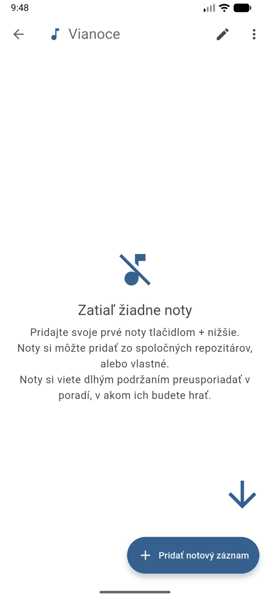
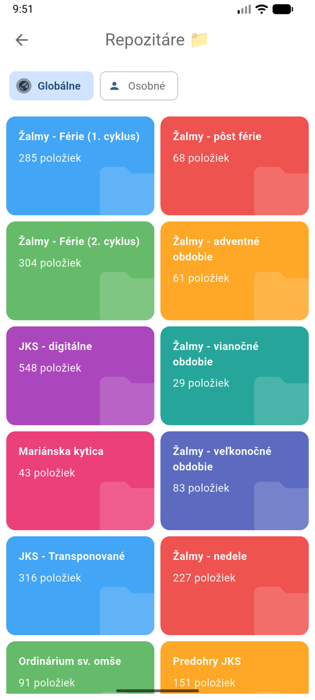
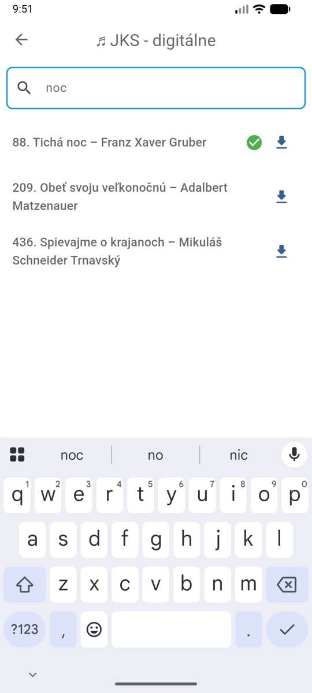
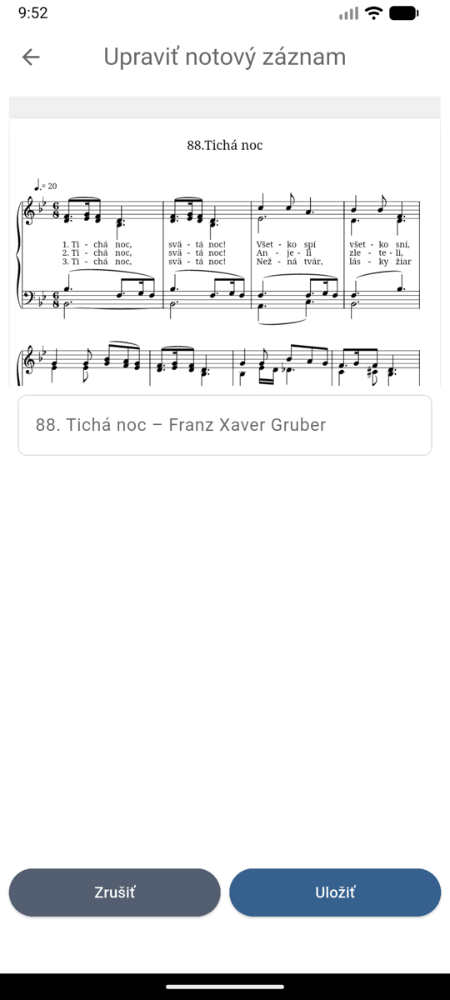

# Pridávanie nôt

Noty sa do zoznamu skladieb pridávajú z **repozitárov** — buď zo spoločných (globálnych),
alebo z vášho osobného repozitára s vlastnými notami.

## Pridanie nôt z repozitára

{ width="300" }

1. Otvorte zoznam skladieb a ťuknite na **+ Pridať notový záznam**.
2. Vyberte repozitár (napr. **JKS - digitálne**).
3. Nájdite pieseň — najrýchlejšie cez políčko **Vyhľadať noty...**
4. Ťuknite na **modrú šípku** (:material-download:) pri piesni.
5. Skontrolujte náhľad, prípadne upravte názov, a ťuknite na **Uložiť**.

{ width="300" }
{ width="300" }

{ width="300" }

!!! tip "Pridanie viacerých piesní naraz"
    Dlhým podržaním prsta na piesni zapnete režim výberu — označíte viac piesní naraz
    (k dispozícii je aj **Vybrať všetko**) a pridáte ich jedným ťuknutím.

Ťuknutím na názov piesne v repozitári si ju môžete najprv prezrieť — pridáte ju
až modrou šípkou.

## Vlastné noty

Ak pieseň v spoločných repozitároch nie je, nahrajte si vlastný súbor —
**obrázok (JPG/PNG), PDF alebo MusicXML** — do svojho osobného repozitára
a odtiaľ ju pridajte do zoznamu rovnakým postupom.

Ako na to, sa dozviete v kapitole [Repozitáre](repositories.md#osobny-repozitar).
