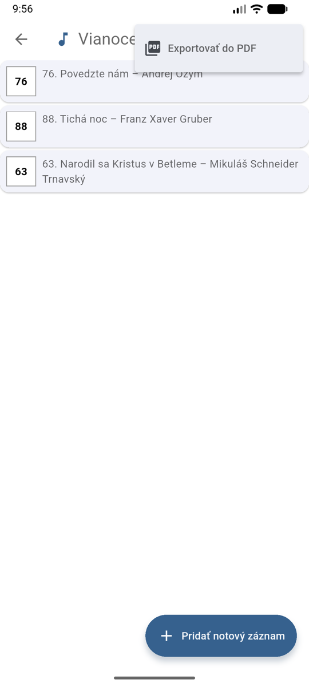
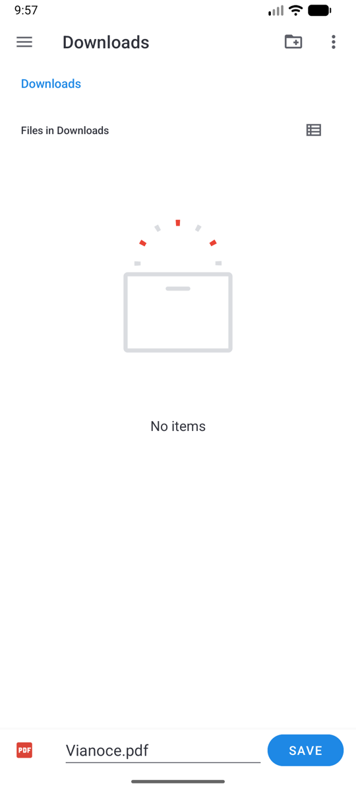
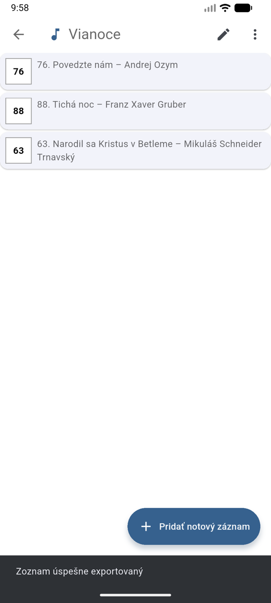

# Export do PDF

Celý zoznam skladieb si viete vyexportovať do jedného PDF súboru — napríklad pre
spevákov, kantora bez aplikácie alebo na vytlačenie.

## Postup

1. Otvorte zoznam skladieb.
2. Ťuknite na menu **⋮** vpravo hore a zvoľte **Exportovať do PDF**.
3. Chvíľu počkajte — aplikácia pripraví všetky noty (pri skladbách MusicXML sa použije
   vaša uložená transpozícia).
4. Vyberte, kam sa má súbor uložiť, a ťuknite na **Uložiť** — súbor sa predvolene
   volá podľa zoznamu (napr. *Vianoce.pdf*).

{ width="300" }
{ width="300" }

Po dokončení sa zobrazí hlásenie **Zoznam úspešne exportovaný**:

{ width="300" }

## Čo výsledné PDF obsahuje

- Noty v poradí, v akom sú v zozname skladieb.
- Obrázky a PDF súbory v pôvodnej podobe.
- Skladby MusicXML vykreslené **s aktuálne nastavenou transpozíciou**.

!!! note
    Ak sa niektorú notu nepodarí stiahnuť alebo pripraviť, export pokračuje ďalej —
    do PDF sa dostanú všetky ostatné noty.
