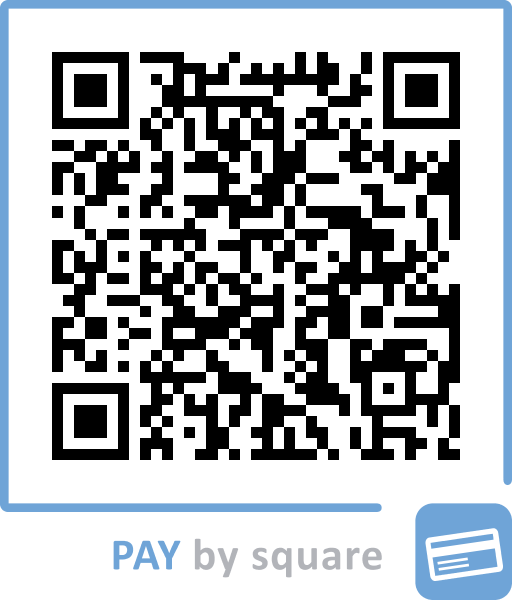

# Časté otázky

## Všeobecné

### Prečo aplikácia vyžaduje registráciu?

Takto je zabezpečené, aby sa súbory daného užívateľa nezobrazovali nikomu inému, ale iba
pod jeho účtom, keď je prihlásený.

Ďalej, aby sa playlisty dali zobrazovať na viacerých zariadeniach (na tablete / mobile)
s rovnakým účtom.

### Je aplikácia zadarmo?

Aplikáciu je možné bezplatne stiahnuť z obchodu Google Play. Mojím zámerom je, aby
finančné prostriedky nepredstavovali prekážku pre organistov, ktorí často túto službu
vykonávajú nezištne a vo svojom voľnom čase. Zároveň si neželám, aby aplikácia obsahovala
rušivé reklamy, ktoré by mohli narušiť priebeh hrania počas liturgie.

### Aký tablet odporúčate používať?

Ideálne čo najväčší, aby sa na ňom dalo pohodlne hrať. Ostatné parametre nie sú tak
dôležité, nakoľko aplikácia je výpočtovo nenáročná.

Prikladám tipy na cenovo dostupné tablety zoradené podľa veľkosti displeja
(ceny orientačné, aktualizované 8/2026):

- **Samsung Galaxy Tab S10 Ultra** - 14,6" - high-end tablet od Samsungu, dosť drahý, ale fakt kvalitný (od cca 830€)
- **TCL NXTPAPER 14** - 14,3" - tablet porovnateľný s A4, trochu drahší (cca 350 - 400€)
- **Teclast T65 2026** - 13,4" - nástupca modelu T65 Max, veľký displej za málo peňazí (cca 175 - 200€)
- **Teclast T65 Max** - 12,95" - ideálny pomer cena veľkosť (cca 220 - 240€)
- **Lenovo Idea Tab Pro** - 12,7" - nástupca modelu Tab P12 (od cca 315€)
- **HONOR Pad 9** - 12,1" - cena okolo 230 - 250€
- **Xiaomi Redmi Pad Pro** - 12,1" - cena okolo 230 - 260€

Osobné skúsenosti nemám ani s jedným z uvedených. Pre cca porovnanie, formát A4 má 14.32",
ale pomer šírka/výška má každý tablet inak.

Tento zoznam nie je úplný, existuje veľa čínskych značiek, avšak objednávať tablet
z Aliexpresu a pod. odporúčam len skúsenejším užívateľom.

Ďalší tip je kúpiť výhodnejšie používaný tablet napr. cez bazoš.

V princípe môže byť hocijaký tablet, na ktorom sa vám bude dobre hrať. Aplikácia je
dostupná pre Android aj iOS, takže do úvahy pripadajú aj iPady —
napr. **iPad Pro 13"** (špičkový, ale drahý) alebo **iPad Air 13"** (rozumnejšia cena). Ak máte tip,
resp. osobné skúsenosti s jedným z týchto tabletov, alebo iných a chceli by ste sa
o ne podeliť, napíšte na
[rozpravaciaappka@gmail.com](mailto:rozpravaciaappka@gmail.com) a informácie sem doplním.

### Ako môžem pomôcť s rozvojom aplikácie?

Možností je viac:

- hľadať a nahlasovať chyby v apklikácii
- ohodnotením aplikácie na Google Play, resp. na App Store
- spolu-vyvíjať (aplikácia je napísaná vo Flutteri, ak vieš programovať, tu je
  [Github repozitár](https://github.com/xvlcekp/organista))
- ak si s aplikáciou spokojný, robiť osvetu vo svojom okolí ľuďom, ktorým by mohla uľahčiť život
- finančným príspevkom

### Z čoho je aplikácia financovaná?

Aplikáciu robím nezištne vo svojom voľnom čase, bez akejkoľvek podpory (podobne ak vy,
organisti, vďaka vám 🙂)

Všetky finančné náklady potrebné na chod a uverejnenie aplikácie, čas strávený s vývojom
robím bezodplatne.

Ak sa Vám aplikácia páči, budem vďačný za akúkoľvek, aj symbolickú finančnú podporu na
číslo účtu:

**IBAN: SK9365000000003651026785**

Platbu môžete jednoducho zadať aj naskenovaním QR kódu (PAY by square) v mobilnej
aplikácii vašej banky:

{ width="300" }

### Zhasne displej počas používania aplikácie?

Časovač vypnutia displeja je možné zrušiť v nastaveniach aplikácie, čo zapríčiní aby aplikácia počas používania
nezhasla. Ak je toto nastavenie vypnuté, zariadenie sa riadi nastavením systému.

### Funguje aplikácia bez internetu?

Pre stiahnutie nôt je potrebný internet (wifi / mobilné dáta). Ak už raz noty stiahnete
a máte ich uložené v playliste, noty sa budú zobrazovať aj bez internetu. Najlepšie je si
to doma vyskúšať s vypnutou wifi, aby vás v kostole nič neprekvapilo. Do budúcna zvažujem
implementovať technicky náročnejšiu možnosť, aby aplikácia fungovala plne offline.

### Je aplikácia dostupná pre iPady, resp. platformu iOS?

Aktualizácia: Od 30.11.2025 je aplikácia k dispozícií aj pre iOS.

Pred tým bola k dispozícii iba pre platformu Android.

### Je možné zdieľať noty s ostatnými?

Aplikácia to neumožňuje, teda vlastné noty vidíte iba vy a nikto iný. Ak máte materiál,
ktorý môže pomocť ostatným, kontatujte ma prosím a noty pridám do repozitárov. Malo by to
byť ucelené a kvalitne oskenované / priamo PDF.

## Aplikácia

### Prečo neviem transponovať niektoré noty?

Digitálna transpozícia funguje len pri notách vo formáte **MusicXML**
(napr. repozitár _JKS - digitálne_). Obrázky a PDF súbory sú „statické" —
aplikácia ich zobrazí, ale noty v nich prepísať nevie.

### Aké súbory si môžem nahrať do osobného repozitára?

Obrázky (JPG, PNG), PDF a MusicXML súbory do veľkosti 4 MB.

### Zabudol som heslo. Čo teraz?

Na prihlasovacej obrazovke ťuknite na **Zabudli ste heslo**, zadajte svoj e-mail
a príde vám odkaz na nastavenie nového hesla.

### Stratím svoje zoznamy pri výmene telefónu?

Nie. Zoznamy skladieb, osobné repozitáre aj nahraté noty sú viazané na váš účet —
stačí sa na novom zariadení prihlásiť.

### Prečo je pri piesni v zozname iný názov ako v repozitári?

Názov noty v zozname skladieb si môžete ľubovoľne upraviť (ceruzka v režime úprav) —
originál v repozitári sa tým nemení.

## Nenašli ste čo ste hľadali?

Môžete sa na mňa obrátiť s akoukoľvek otázkou.

Kontakt: [rozpravaciaappka@gmail.com](mailto:rozpravaciaappka@gmail.com)
