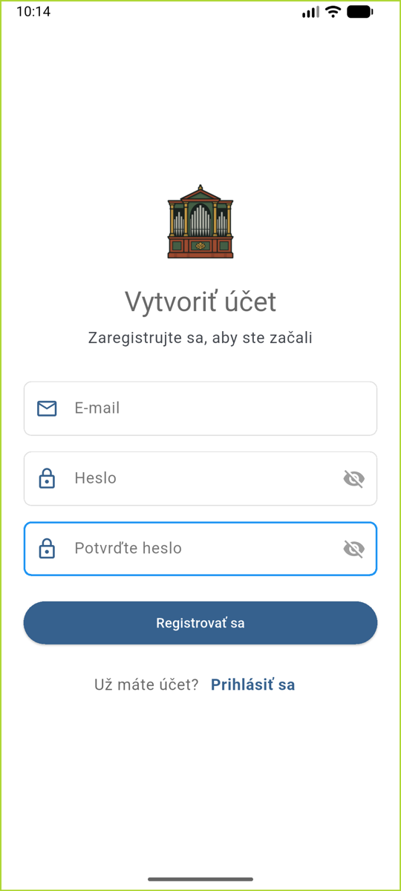
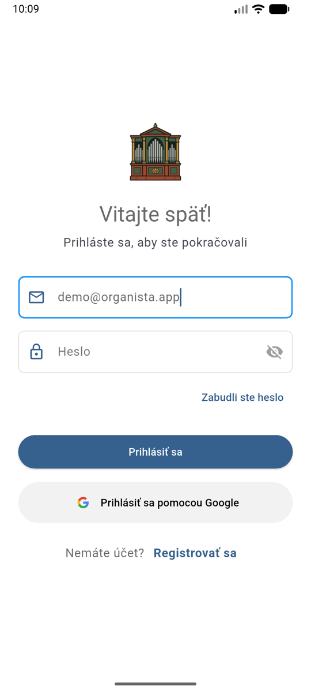
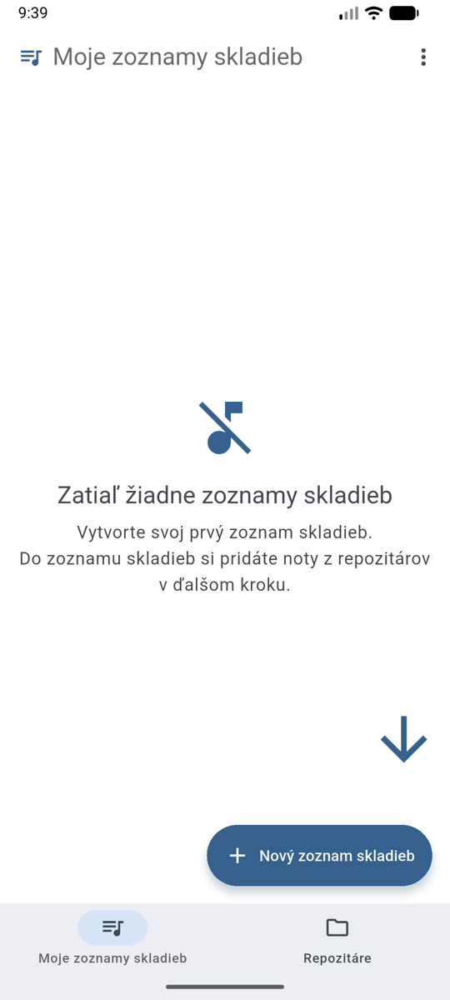

# Začíname

Na používanie aplikácie potrebujete účet — vďaka nemu sú vaše vlastné noty súkromné
a zoznamy skladieb sa synchronizujú medzi zariadeniami: pripravíte si ich v mobile
a hráte z tabletu, stačí sa prihlásiť tým istým účtom.

## Vytvorenie účtu

1. Otvorte aplikáciu a na prihlasovacej obrazovke ťuknite na **Vytvoriť účet**.
2. Zadajte svoj **e-mail**, zvoľte si **heslo** a potvrďte ho v poli **Potvrďte heslo**.
3. Ťuknite na **Registrovať sa**.

{ width="300" }

!!! tip "Rýchlejšia možnosť"
    Registrovať aj prihlásiť sa môžete jedným ťuknutím cez **Prihlásiť sa pomocou Google**
    alebo **Prihlásiť sa pomocou Apple** — bez vymýšľania nového hesla.

## Prihlásenie

1. Na prihlasovacej obrazovke zadajte svoj **e-mail** a **heslo**.
2. Ťuknite na **Prihlásiť sa**.

Po prihlásení sa otvorí obrazovka **Moje zoznamy skladieb** — vaša domovská obrazovka.

{ width="300" }
{ width="300" }

## Zabudnuté heslo

1. Na prihlasovacej obrazovke ťuknite na **Zabudli ste heslo**.
2. Zadajte svoj e-mail a ťuknite na **Obnoviť heslo**.
3. Do e-mailovej schránky vám príde odkaz na nastavenie nového hesla.

## Odhlásenie

V **Nastaveniach** (ozubené koliesko vpravo hore) nájdete v časti **Správa účtu**
tlačidlo **Odhlásiť sa**.
