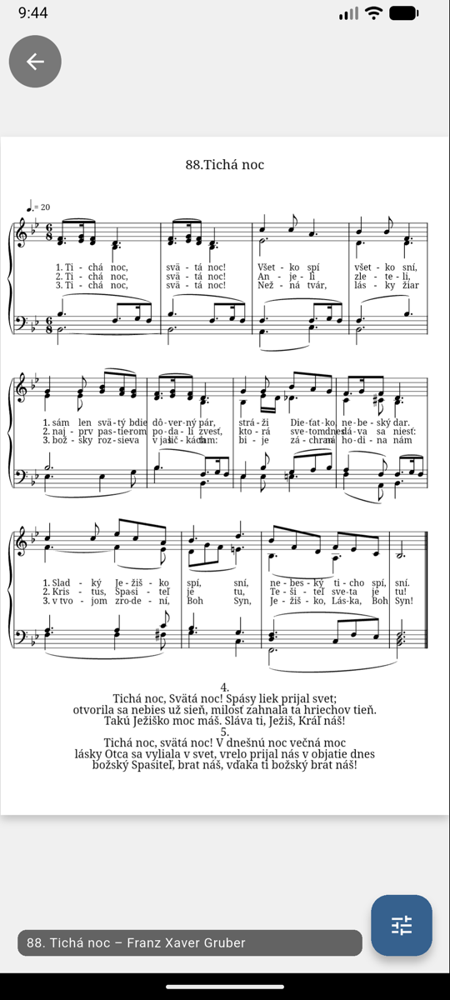

# Vitajte v aplikácii Organista

{ width="120" align=right }

**Organista** je mobilná aplikácia pre organistov a hudobníkov, ktorá vám pomôže mať všetky noty
vždy po ruke — usporiadané presne v poradí, v akom ich budete hrať.

## Čo aplikácia dokáže

- **Zoznamy skladieb** — pripravte si noty na svätú omšu či koncert dopredu a počas hrania už len listujte.
- **Spoločné repozitáre nôt** — vyberajte z pripravených notových záznamov (napr. Jednotný katolícky spevník),
  alebo si nahrajte vlastné noty ako obrázok, PDF či MusicXML.
- **Digitálna transpozícia** — skladby vo formáte MusicXML si priamo v aplikácii transponujete
  o ľubovoľný počet poltónov vyššie alebo nižšie.
- **Export do PDF** — celý zoznam skladieb si vyexportujete do jedného PDF súboru, napríklad pre
  spevákov alebo na tlač.
- **Funguje aj bez internetu** — noty, ktoré ste už raz otvorili (s internetom), sa zobrazia aj offline.

{ width="300" }
{ width="300" }

## Inštalácia

Aplikácia je dostupná pre Android v obchode Google Play a pre iPhone/iPad v App Store:

[:material-google-play: Stiahnuť z Google Play](https://play.google.com/store/apps/details?id=sk.anickaapavol.organista){ .md-button .md-button--primary }
[:material-apple: Stiahnuť z App Store](https://apps.apple.com/sk/app/organista/id6755677722){ .md-button .md-button--primary }

Aplikácia je **bezplatná a bez reklám** — organisti často slúžia vo svojom voľnom čase
a rušivé reklamy do liturgie nepatria.

## Ako začať

1. [Vytvorte si účet a prihláste sa](getting-started.md)
2. [Vytvorte si prvý zoznam skladieb](playlists.md)
3. [Pridajte doň noty z repozitára](adding-music-sheets.md)
4. [Hrajte!](viewing-music-sheets.md)

Celý postup — od vytvorenia zoznamu skladieb, pridania nôt a zapnutia navigačných šípok
až po hranie s otáčaním strán — si môžete pozrieť v krátkom videu:

<video autoplay loop muted playsinline controls width="300">
  <source src="assets/videos/complete-walkthrough.mp4" type="video/mp4">
</video>
