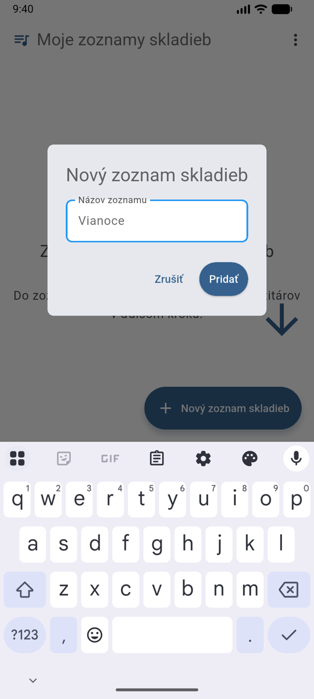
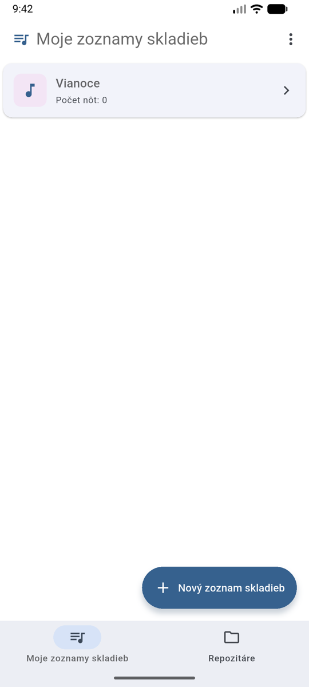
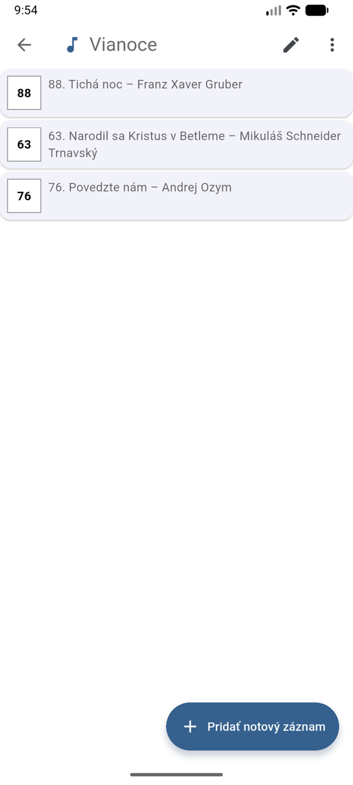

# Zoznamy skladieb

Zoznam skladieb je vaša príprava na konkrétnu príležitosť — svätú omšu, sobáš, pohreb či koncert.
Noty v ňom máte v poradí, v akom ich budete hrať, a počas hrania medzi nimi len listujete.

Obrazovka **Moje zoznamy skladieb** je domovská obrazovka aplikácie.

## Vytvorenie zoznamu

1. Na obrazovke **Moje zoznamy skladieb** ťuknite na tlačidlo **+ Nový zoznam skladieb**.
2. Zadajte názov (napr. *Vianoce*, *Sobáš 14. 9.*) a ťuknite na **Pridať**.

{ width="300" }
{ width="300" }

Pri každom zozname vidíte počet nôt, ktoré obsahuje.

## Premenovanie a vymazanie zoznamu

- **Premenovať** — dlho podržte prst na zozname a zadajte nový názov.
- **Vymazať** — potiahnite zoznam prstom doľava a potvrďte. *Táto akcia sa nedá vrátiť späť.*

<video autoplay loop muted playsinline controls width="300">
  <source src="../assets/videos/deleting-playlist.mp4" type="video/mp4">
</video>

## Práca s notami v zozname

Ťuknutím zoznam otvoríte. Noty pridáte tlačidlom **+ Pridať notový záznam** —
podrobne v kapitole [Pridávanie nôt](adding-music-sheets.md).

{ width="300" }

### Zmena poradia

Dlho podržte prst na note a potiahnite ju na nové miesto:

<video autoplay loop muted playsinline controls width="300">
  <source src="../assets/videos/reordering-sheets.mp4" type="video/mp4">
</video>

### Premenovanie a vymazanie noty

Ťuknite na **ceruzku** vpravo hore — zoznam sa prepne do režimu úprav a pri každej note
sa zobrazia ikony na **premenovanie** (ceruzka) a **vymazanie** (kôš). Premenovanie noty
v zozname nemení notu v repozitári — každý si ju môže nazvať po svojom.

!!! tip
    Vymazaním noty zo zoznamu ju odstránite len z tohto zoznamu — v repozitári zostáva ďalej dostupná.
