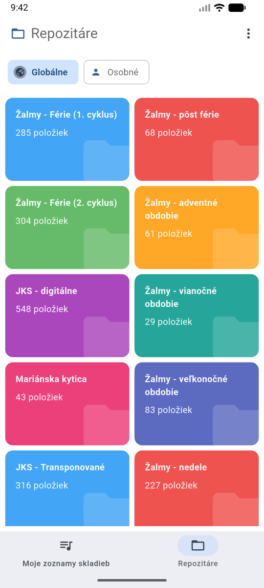
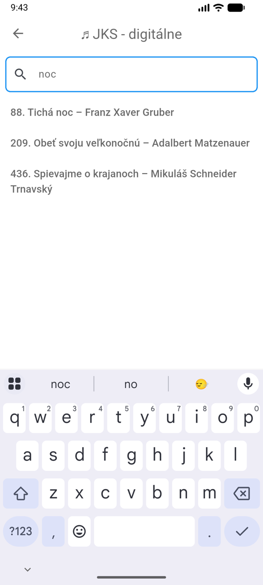
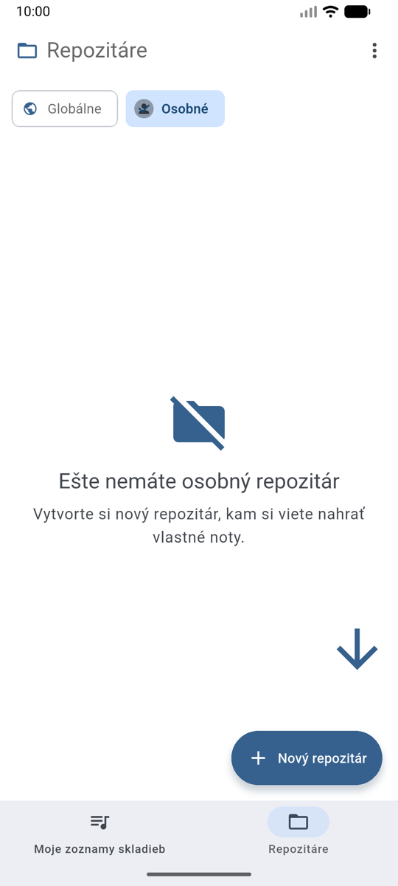
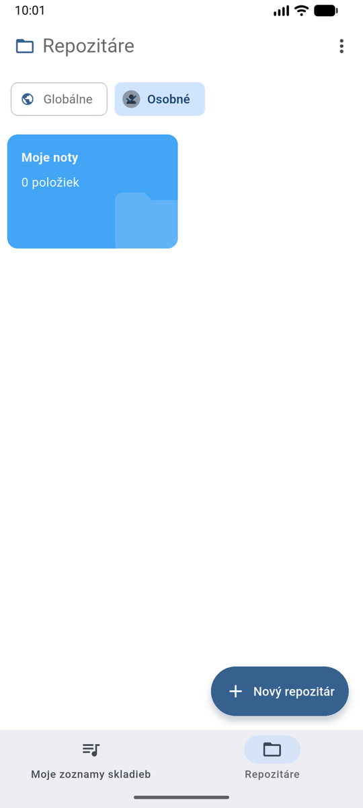
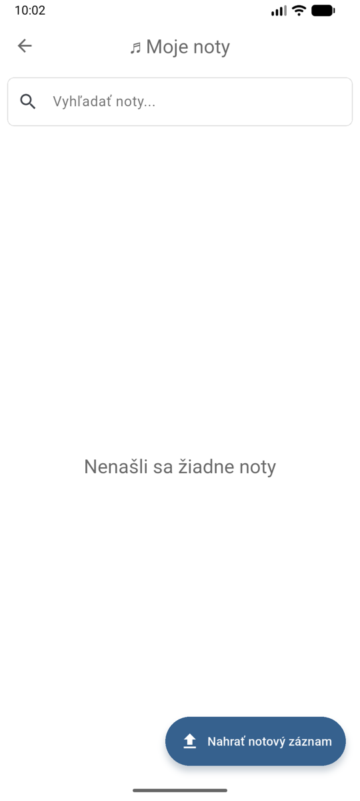
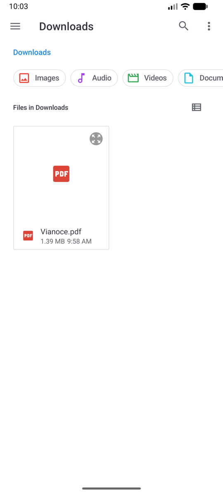
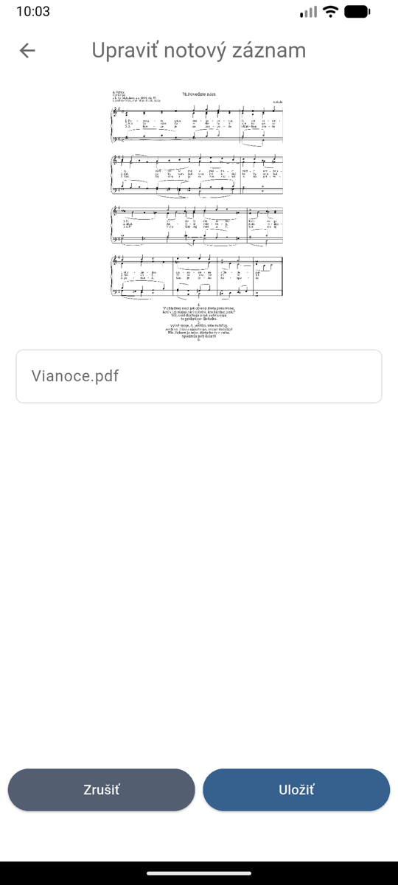
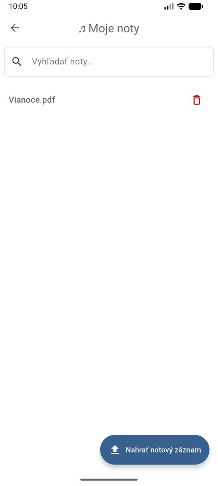

# Repozitáre

Repozitár je knižnica notových záznamov. Nájdete ich na spodnej lište pod záložkou **Repozitáre**.

## Globálne repozitáre

Spoločné knižnice dostupné všetkým používateľom — napríklad **JKS - digitálne**
(Jednotný katolícky spevník v digitálnej podobe s možnosťou transpozície), žalmy pre
jednotlivé liturgické obdobia, **Mariánska kytica**, **Ordinárium sv. omše** či jeho digitálna verzia
**Ordinárium sv. omše - digitálne** (zdigitalizoval Tomáš Polonec pre MuseScore; zatiaľ testovacia verzia, noty neprešli
kontrolou - viac v [Zdrojoch nôt](music-sheet-sources.md)).

{ width="300" }

Globálne repozitáre sa nedajú upravovať — noty z nich si pridávate do svojich zoznamov skladieb.

!!! info "Odkiaľ noty pochádzajú"
Prehľad všetkých zdrojov aj históriu pridávania nôt nájdete na stránke
[Zdroje nôt](music-sheet-sources.md).

### Vyhľadávanie

V repozitári píšte do políčka **Vyhľadať noty...** — výsledky sa filtrujú priebežne.

{ width="300" }
{ width="300" }

!!! info "Zelená fajka"
Zelená fajka pri piesni znamená, že notový záznam je uložený v pamäti telefónu
a zobrazí sa **aj bez internetu**.

## Osobný repozitár

Vlastná knižnica, do ktorej si nahrávate noty, ktoré v globálnych repozitároch nie sú —
naskenované obrázky, PDF súbory alebo MusicXML.

### Vytvorenie repozitára

1. Na záložke **Repozitáre** prepnite na **Osobné**.
2. Ťuknite na **+ Nový repozitár**, zadajte názov a potvrďte tlačidlom **Pridať**.

{ width="300" }
{ width="300" }

### Nahranie vlastných nôt

1. Otvorte svoj repozitár a ťuknite na **Nahrať notový záznam**.
2. Vyberte súbor v telefóne — **obrázok (JPG/PNG), PDF alebo MusicXML** (max. 4 MB).
3. Skontrolujte náhľad, upravte názov a ťuknite na **Uložiť**.

{ width="300" }
{ width="300" }

{ width="300" }
{ width="300" }

Nahraté noty potom pridávate do zoznamov skladieb rovnako ako noty z globálnych
repozitárov — pozri [Pridávanie nôt](adding-music-sheets.md).

### Správa osobného repozitára

- **Premenovanie / vymazanie repozitára** — dlho podržte prst na karte repozitára.
  Vymazaním repozitára sa vymažú aj všetky noty v ňom!
- **Premenovanie noty** — ťuknite na ikonu ceruzky pri note.
- **Vymazanie noty** — ťuknite na ikonu koša pri note.
