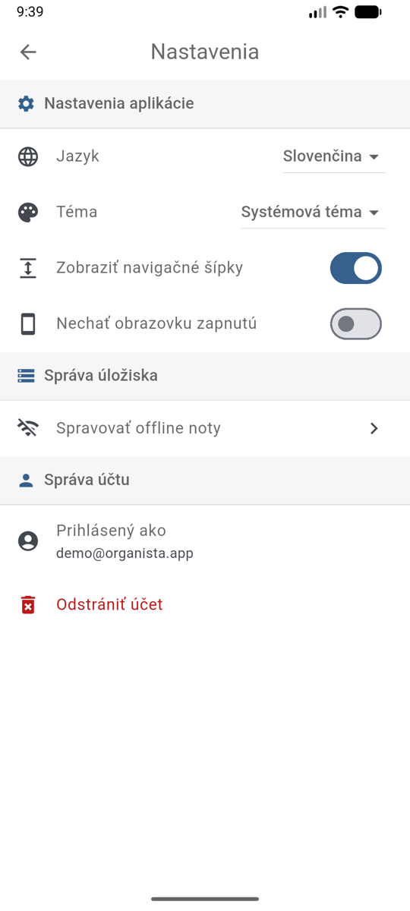
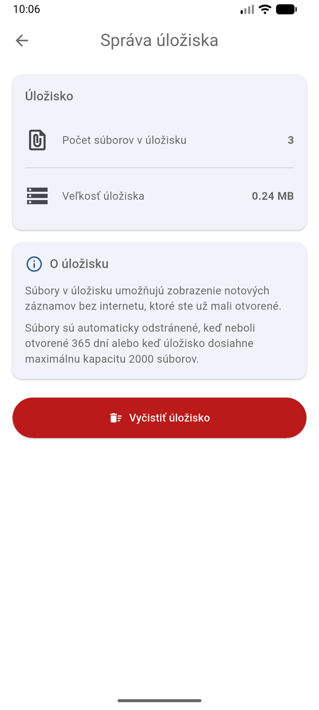

# Nastavenia

Nastavenia otvoríte cez menu **⋮** vpravo hore → **Nastavenia**.

{ width="300" }

## Nastavenia aplikácie

- **Jazyk** — slovenčina alebo angličtina.
- **Téma** — svetlá, tmavá alebo systémová (podľa nastavenia telefónu).
- **Zobraziť navigačné šípky** — pri viacstranových PDF notách sa na okraji obrazovky
  zobrazí šípka na okamžité otočenie strany jedným ťuknutím.
- **Nechať obrazovku zapnutú** — počas zobrazenia nôt obrazovka nezhasne.
  Odporúčame zapnúť pri hraní.

## Správa úložiska

Pod položkou **Spravovať offline noty** nájdete prehľad súborov uložených v telefóne:

{ width="300" }

Noty, ktoré ste už mali otvorené, sa ukladajú do pamäte telefónu, aby sa zobrazili
**aj bez internetu**. Súbory sa automaticky odstraňujú, keď neboli dlho otvorené
alebo keď úložisko dosiahne maximálnu kapacitu. Tlačidlom **Vyčistiť úložisko**
môžete pamäť uvoľniť ručne — noty sa pri ďalšom otvorení znova stiahnu.

## Správa účtu

- **Prihlásený ako** — e-mail aktuálne prihláseného účtu.
- **Odhlásiť sa** — nájdete v menu **⋮** na domovskej obrazovke.
- **Odstrániť účet** — natrvalo vymaže váš účet aj všetky vaše dáta (zoznamy skladieb,
  osobné repozitáre a nahraté noty). *Táto akcia sa nedá vrátiť späť.*
