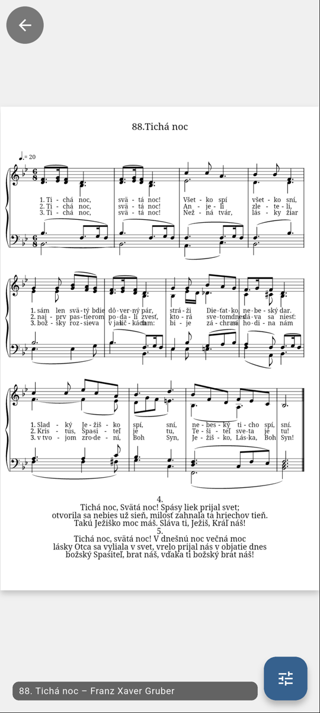
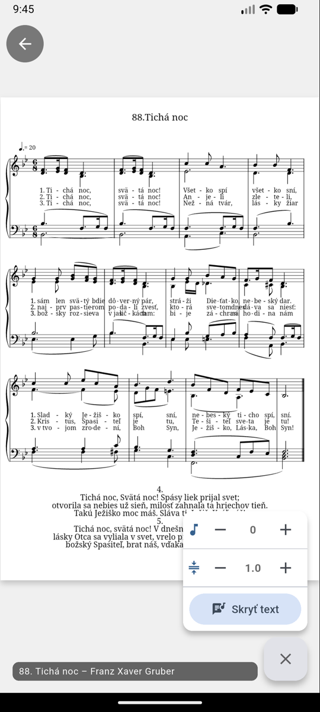
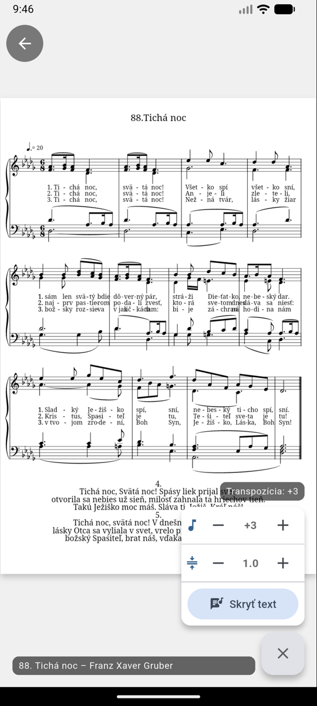

# Zobrazenie nôt

Ťuknutím na notu v zozname skladieb sa noty otvoria na celú obrazovku — pripravené na hranie.

{ width="300" }

## Listovanie medzi skladbami

Medzi skladbami zoznamu listujete **potiahnutím prsta** doľava/doprava — v poradí,
v akom ste si ich usporiadali:

<video autoplay loop muted playsinline controls width="300">
  <source src="../assets/videos/switching-songs.mp4" type="video/mp4">
</video>

## Viacstranové noty a navigačné šípky

Pri viacstranových PDF notách vidíte vpravo dole **počítadlo strán** (napr. *1/2*).
Ak si v [Nastaveniach](settings.md) zapnete **Zobraziť navigačné šípky**, horný
a dolný okraj obrazovky sa zmení na **zelenkasté dotykové plochy so šípkou** — ťuknutím
na dolnú plochu otočíte na ďalšiu stranu, ťuknutím na hornú späť. Rýchlejšie
a spoľahlivejšie než posúvanie prstom; otočenie prebehne okamžite:

<video autoplay loop muted playsinline controls width="300">
  <source src="../assets/videos/page-navigation.mp4" type="video/mp4">
</video>

Celý postup — vytvorenie zoznamu, pridanie nôt, zapnutie šípok v nastaveniach
a hranie s otáčaním strán — ukazuje [video na úvodnej stránke](index.md).

!!! tip
    V [Nastaveniach](settings.md) si zapnite aj **Nechať obrazovku zapnutú**,
    aby počas hrania nezhasla.

!!! note "Bluetooth pedál alebo klávesnica"
    Na listovanie môžete použiť aj **Bluetooth pedál či klávesnicu** — šikovné,
    keď máte obe ruky (aj nohy) zamestnané hraním.

## Transpozícia (MusicXML)

Noty vo formáte **MusicXML** (napr. repozitár *JKS - digitálne*) si viete digitálne
transponovať — celá skladba sa prepíše do novej tóniny, žiadne prelepovanie ani
hranie z hlavy.

1. Ťuknite na modré tlačidlo ovládania vpravo dole.
2. Tlačidlami **+** / **−** pri ikone noty transponujete o poltón vyššie/nižšie.
3. Aktuálna transpozícia sa zobrazuje v paneli (napr. **+3**); ťuknutím na hodnotu ju vynulujete.

{ width="300" }
{ width="300" }

<video autoplay loop muted playsinline controls width="300">
  <source src="../assets/videos/transposition.mp4" type="video/mp4">
</video>

Transpozícia sa pri note v zozname skladieb **zapamätá** — pri ďalšom otvorení aj pri
[exporte do PDF](export-pdf.md) sa použije naposledy nastavená hodnota.

V paneli nájdete aj:

- **Rozšíriť/zúžiť medzery v texte** (tlačidlá pri ikone **÷**) — upraví hustotu textu pod notami,
- **Skryť text / Zobraziť text** — schová alebo zobrazí text piesne pod notami.

## Práca bez internetu

Noty, ktoré ste už mali otvorené, sa ukladajú do pamäte telefónu a zobrazia sa aj bez
pripojenia — na chóre bez signálu sa teda na svoj zoznam skladieb môžete spoľahnúť.
V repozitári ich spoznáte podľa zelenej fajky. Podrobnosti o úložisku nájdete
v [Nastaveniach](settings.md#sprava-uloziska).
